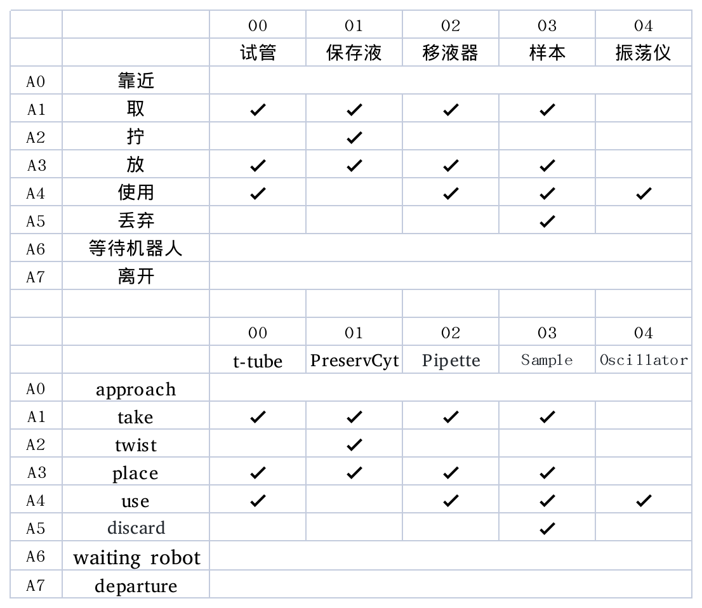
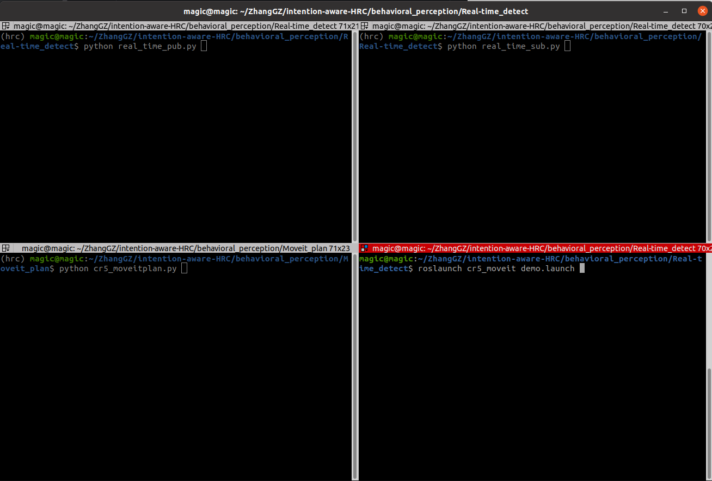
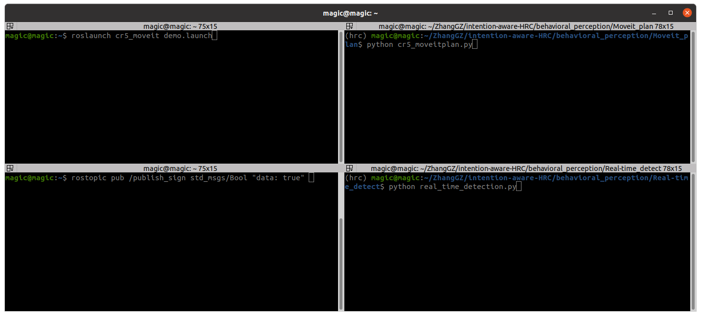

# 行为预测及Moveit避障处理
## 1.基于PEC数据集的训练与评估（CoAx数据集同理）
### 1.1 PEC数据集动作编码表
<br/>
     

### 1.2 pec程序含义(CoAx同理)
```
pec_train.py     --按照1.1分类训练Resnet-RNN网络
pec_eval.py      --评估Resnet-RNN网络检测效果
pec_result.txt   --包含了各项评估数据
pec_result.json  --包含了1.1中14类动作的分类检测指标
```
程序直接运行即可

## 2.实时检测并调用Moveit进行避障路径规划
### 2.1 包含三个程序文件：
```
Real-time_detect/real_time_pub.py  --实时显示场景画面并将RGB图和深度图通过ros-cv_bridge发布
Real-time_detect/real_time_sub.py  --接受cv_bridge发布的图像并通过PecNet预测动作与轨迹
Moveit_plan/cr5_moveitplan.py      --封装了Moveit的Python接口，用以在moveit空间中添加障碍物以及生成机械臂运动规划
```
### 2.2 程序运行方式
* 连接realsenseD455相机，连接CR5机械臂，将主机IPV4地址修改为
```192.168.5.10```
* 打开Terminator终端，按照图示路径分为四个界面，进入hrc虚拟环境:
```source activate hrc```

    <br/>
     


* 按照以下顺序启动程序：（次选）
  1. 启动ros节点
     ```
     roscore
     ```
  2. 启动CR5机械臂Moveit模型
     ```
     roslaunch cr5_moveit demo.launch
     ```
  3. 启动Moveit接口程序
     ```
     python cr5_moveitplan.py
     ```
  4. 启动实时检测发布程序
     ```
     python real_time_pub.py 
     ```
  5. 启动订阅处理程序
     ```
     python real_time_sub.py 
     ```
* 另一种效果较好的启动方式（首选）
  * 参照下图启动终端
      <br/>
     
  * iv.和v.可以用这个指令代替
     ```
     python real_time_detection.py
     ```
  * 另开一个终端用ros发送信号触发机械臂动作
      ```
      rostopic pub /publish_sign std_msgs/Bool "data: true"
      ```
  
